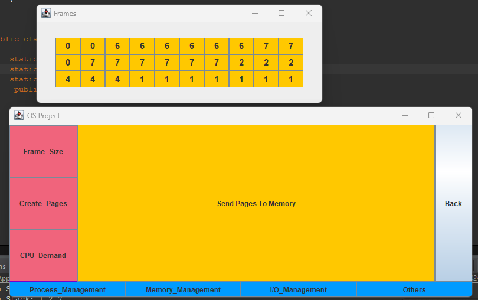

# OS-Simulation-Java

## Description
This is my project I made to demonstrate my knowledge in Operating System Course, showing how a single-core processor does Process Scheduling and Memory management. Built using Client-Server architecture (Networking, you need 2 systems for this, or you can create two instances as well) where the client can create multiple processes in the Server machine. I have used Java Swing and AWT for the GUI.
I have used various OOP and DSA concepts. However, my main focus was on GUI.

## About the Project
I have used GridLayout for processes and memory JPanel buttons, and all are packed in a BorderLayout for ease of access. 
You can create as many processes as you want and enter the memory size. Based on that, pages will be created (further used in LRU memory management). 
You can see the Ready Queue as soon as you create a process.

## Scheduling
There are two types of scheduling algorithms I used. The default one is FCFS (First Come-First-Serve) and the second one is Round-Robin (remember to set the quantum time for RR). When you run a process, based on the scheduling selected, you will see how it affects the ready queue and Gantt Chart. There are other options like Suspend and Block where the process goes into the blocked Queue. To run the created process, just click on Dispatch.

## Memory Management
I have implemented LRU (Least Recently Used) only in this project. You can either pass on your pages of processes, created in scheduling, to the memory, or you can just use the Create_page and set the page size. You can try an example here: 4, 7, 6, 1, 7, 6, 1, 2, 7, 2.

## IDE Used
I made this in Eclipse IDE.
Overall, it was a fun project; I got to practice a lot of OOP/DSA concepts and successfully learned GUI Development in Java.

